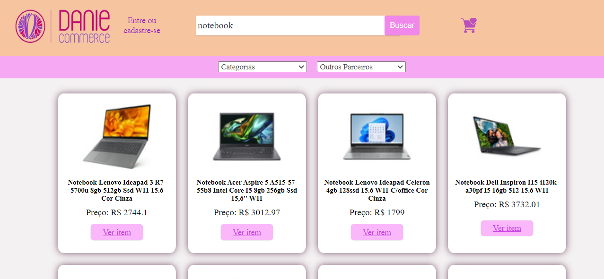

<h1 align = 'center'> Bem vindo(a) ao Danie-commerce!</h1>

💻 Este projeto foi desenvolvido como avaliação final do curso de Front-End ministrado pela <a href ='https://www.campinhodigital.org/'>Campinho Digital</a>.

## 📑 Descrição do projeto:

Atualmente muitas pessoas aderem a programas de afiliação oferecidos por grandes empresas de E-Commerce, com o objetivo de obter uma renda extra. Pensando em  melhorar a experiência do usuário, reunir vários programas em um único site e aumentar as vendas através de uma interface amigável, desenvolvi o Danie-commerce, uma página web que consome a API de ofertas diárias do Mercado Livre e exibe os produtos de forma organizada e atrativa.

## 🔓 Acesso:
A página web está disponível em: 

## ⚙️ Funcionalidades: 
### 🔍 Busca
- 1º Passo:  Para encontrar qualquer produto, digite o nome no campo "Buscar produtos, marcas e muito mais..."
- 2º Passo: Clique no botão "Buscar"
- 3º Passo: Após escolher o produto, clice em "Ver item". Você será direcionado para a loja oficial e poderá finalizar a compra

